<!-- ═══════════════════════════════════════════════════════════════════════════ -->
<!--                           Z Y N V A R O                                  -->
<!--        AI-Powered Parametric Income Shield for Q-Commerce India           -->
<!-- ═══════════════════════════════════════════════════════════════════════════ -->

<div align="center">


### *When the city stops, your income doesn't.*

<br>

[](https://devtrails.guidewire.com)
[](#-team-aerofyta)
[](#)
[](#)

<br>


---

**Zynvaro** is a **zero-touch parametric insurance platform** that automatically detects weather disasters, platform outages, and civic disruptions — and pays gig delivery workers **within 5 minutes**, with **no claims, no forms, no calls**.

> *Built for Guidewire DEVTrails 2026 — Unicorn Chase*

</div>

---

> [!IMPORTANT]
> **What is Parametric Insurance?** Unlike traditional insurance where you file a claim and wait, parametric insurance pays out **automatically** when a measurable trigger crosses a threshold. If IMD rainfall data shows > 64.5mm in your zone — you get paid. Period. No adjuster, no paperwork, no waiting.

---

## 📑 Table of Contents

<details open>
<summary><b>Click to navigate</b></summary>

| # | Section | What You'll Learn |
|:-:|---------|------------------|
| 🔥 | [The Crisis](#-the-crisis--why-this-matters) | Why 12.7M gig workers need this |
| 🎯 | [Our Persona](#-our-persona--the-10-minute-sprinter) | Why Q-Commerce, not food delivery |
| 🎬 | [Live Scenarios](#-live-scenarios--how-zynvaro-responds) | 4 real-world disruption walkthroughs |
| 💰 | [Premium Model](#-weekly-premium-model) | ₹29-₹89/week dynamic pricing |
| ⚡ | [Parametric Triggers](#-parametric-triggers--what-fires-a-payout) | 6 measurable trigger events |
| 🧠 | [AI/ML Engine](#-aiml-engine) | 4-layer fraud detection + predictive risk |
| 🛡️ | [Anti-Spoofing](#-adversarial-defense--anti-spoofing-strategy) | 7-signal authenticity scoring |
| 📱 | [User Experience](#-zero-touch-claims--the-user-experience) | 3-screen onboarding, invisible claims |
| 🏗️ | [Architecture](#-tech-stack--architecture) | Full system design + tech choices |
| 📊 | [Unit Economics](#-financial-viability--unit-economics) | LTV/CAC 9.7x, 62.8% loss ratio |
| 🗺️ | [Roadmap](#-development-roadmap) | Phase 2 & 3 deliverables |
| 🏆 | [Why We Win](#-why-zynvaro-wins) | 5 unicorn differentiators |

</details>

---


<a name="-the-crisis--why-this-matters"></a>

<div align="center">

```
     ╔══════════════════════════════════════════════════════════════╗
     ║                                                              ║
     ║   🌧️ Mumbai floods → 3 days lost income → ₹0 recourse       ║
     ║   🏭 Delhi AQI 828 → riders can't breathe → ₹0 recourse     ║
     ║   ☁️ Cloudflare down → Blinkit dies → ₹0 recourse            ║
     ║                                                              ║
     ║   Platform insurance covers accidents.                       ║
     ║   Government covers hospitalization.                         ║
     ║                                                              ║
     ║   ❌ NOBODY covers income loss from external disruptions.    ║
     ║                                                              ║
     ║   ✅ Zynvaro fills this gap.                                 ║
     ║                                                              ║
     ╚══════════════════════════════════════════════════════════════╝
```

</div>

India's **12.7 million gig workers** power the digital economy. Yet **80% have zero formal insurance**, and **no existing product** covers income loss from external disruptions.

### 📉 The Numbers That Define the Crisis

| Metric | Data | Source |
|:-------|:----:|:------:|
| Gig workers with **zero savings** | **90%** | NITI Aayog |
| Earnings drop during heatwave days | **40%** | Nature 2024 (Das & Somanathan) |
| Income loss per 1°C wet-bulb rise | **19%** | Nature 2024 |
| Q-Commerce GMV (2024) | **$6-7B** | RedSeer / Bain |
| Annual heatwave days across India | **536** | CII / IMD |
| Delhi AQI > 400 days per winter | **30-50** | CPCB |

> [!CAUTION]
> When a disruption hits a Q-Commerce zone, riders don't gradually lose income — they go from **full earnings to ₹0 in minutes**. The platform algorithm shuts down the zone instantly. No orders = no income = no safety net. Until now.

---


<a name="-our-persona--the-10-minute-sprinter"></a>

### Why Q-Commerce (Blinkit / Zepto / Instamart) — Not Food Delivery

> [!TIP]
> Most teams will default to Zomato/Swiggy food delivery riders. We chose **Q-Commerce** because it is **structurally more vulnerable** to disruptions — making it the ideal blue-ocean for parametric insurance.

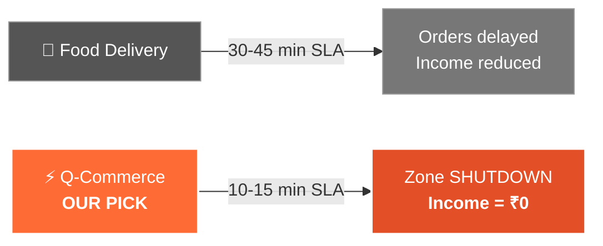

| Factor | Food Delivery | Q-Commerce **(Our Pick)** |
|:------:|:------------:|:------------------------:|
| Delivery SLA | 30-45 min | **⚡ 10-15 min** |
| Delivery Radius | Up to 7 km | **📍 2-3 km (dark store)** |
| 30 min heavy rain impact | Orders delayed | **🚫 Entire zone PAUSED** |
| Algorithmic response | Reduced orders | **⛔ Instant zone shutdown** |
| Disruption measurability | Moderate | **📏 HIGH** (tight geofence) |

> Q-Commerce operates on an ultra-condensed supply chain. When a localized disruption hits — a flooded intersection near a dark store, a sudden AQI spike — the platform's algorithm **instantly disables the zone**. This **"SLA brittleness"** makes Q-Commerce the ideal candidate for parametric insurance.

### 👤 Meet Ravi — Our Target User

<table>
<tr>
<td width="70%">

> **Ravi, 27** — Blinkit rider in Koramangala, Bangalore
> - 🛵 Rides a 2-wheeler, works peak + late shift (6 PM - 2 AM)
> - 💰 Nets ~₹18,000-21,000/month after fuel
> - 🏪 Operates from a dark store cluster
> - 💳 **Zero savings. Zero insurance.**
>
> During Bangalore's October 2024 flooding (157mm in 6 hours), Q-commerce operations were **completely halted** — Ravi earned **₹0 for 2 days**.

</td>
<td width="30%" align="center">

**What makes Ravi pay ₹49/week?**

🪙 Micro-pricing<br><sub>Less than 1 delivery order</sub>

😰 Loss-aversion framing<br><sub>"Your income is at risk"</sub>

🔄 UPI AutoPay<br><sub>Status quo bias</sub>

⚡ Instant value<br><sub>"Covered for tonight"</sub>

✅ Deterministic rules<br><sub>Verify on IMD yourself</sub>

</td>
</tr>
</table>

---


<a name="-live-scenarios--how-zynvaro-responds"></a>

### Scenario 1: 🌧️ Monsoon Flooding <sup><sub>HIGH FREQUENCY</sub></sup>

> **Tuesday, 7:45 PM** — Ravi starts his evening shift. At 8:30 PM, torrential rain begins — **72mm in 90 minutes**. The dark store pauses all orders. Ravi is stuck under a shop awning.

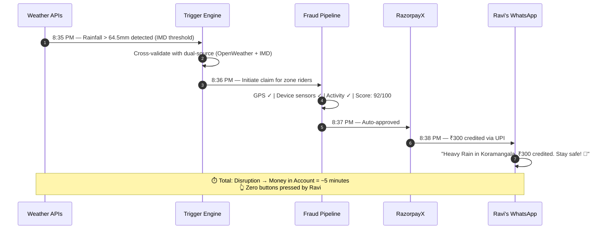

### Scenario 2: ☁️ Platform Outage <sup><sub>NOVEL — MOST TEAMS WILL MISS THIS</sub></sup>

> **Saturday, 1:15 PM** — Cloudflare global outage. Blinkit, Zepto, Swiggy APIs return HTTP 503. **200,000+ riders** nationwide unable to receive orders.

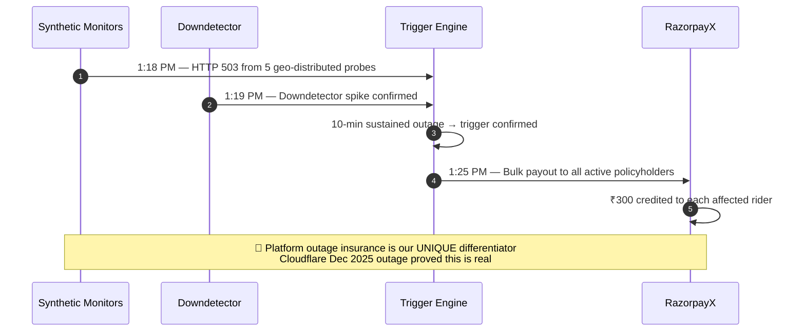

<details>
<summary><b>📋 Scenario 3: Severe Air Pollution (Delhi)</b></summary>

> **November 15, Delhi** — AQI hits **485 ("Severe")**. GRAP Stage IV activated.

1. WAQI API + CPCB station both report AQI > 400 for 24 continuous hours
2. Dual-source validation confirms the event
3. Riders in affected pincodes receive partial-day payout (**₹150**) reflecting ~20-30% income impact

</details>

<details>
<summary><b>🚨 Scenario 4: Coordinated Fraud Attempt (Market Crash)</b></summary>

> **500 riders in Mumbai organize via Telegram** — install GPS-spoofing apps, fake locations into a red-alert weather zone while sitting at home.

**Zynvaro's Response:** → See [Adversarial Defense & Anti-Spoofing Strategy](#️-adversarial-defense--anti-spoofing-strategy)

*Spoiler: Our 7-signal authenticity scoring catches them. GPS alone is only 10% of the score.*

</details>

### 🔄 End-to-End Application Workflow

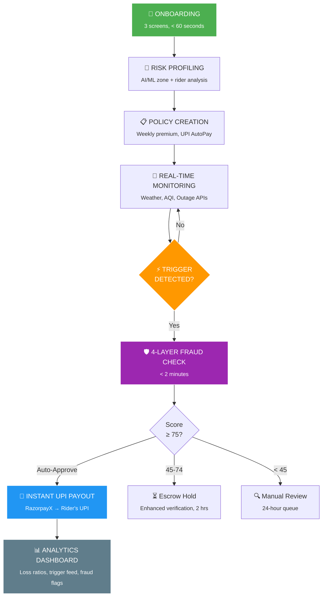

---


<a name="-weekly-premium-model"></a>

### Why Weekly — Not Monthly or Annual

> Gig workers operate **week-to-week**. Their platform payouts settle weekly. A ₹200/month premium triggers loss aversion. A **₹49/week** premium — deducted on payout day via UPI AutoPay — feels like a platform fee, not an insurance bill.

### 📋 Coverage Tiers

<div align="center">

| | 🟢 **Basic Shield** | 🔵 **Standard Guard** | 🟣 **Pro Armor** |
|:--|:--:|:--:|:--:|
| **Weekly Premium** | **₹29** | **₹49** | **₹89** |
| AQI > 400 | ✅ 35% income | ✅ 55% income | ✅ 70% income |
| Heatwave > 45°C | ✅ 35% income | ✅ 55% income | ✅ 70% income |
| Heavy Rainfall | ✅ 35% income | ✅ 55% income | ✅ 70% income |
| Extreme Rain / Flooding | ✅ 55% income | ✅ 72% income | ✅ 90% income |
| Platform Outage | ✅ 25% income | ✅ 45% income | ✅ 65% income |
| Civil Disruption | ✅ 35% income | ✅ 55% income | ✅ 75% income |
| Max Daily Payout | ₹300 | ₹600 | ₹1,000 |
| Max Weekly Payout | ₹600 | ₹1,200 | ₹2,000 |
| **Target User** | *Part-time,<br>low-risk city* | *Full-time,<br>avg-risk city* | *High-risk weeks<br>(monsoon/pollution)* |

> **Payout = estimated daily gig income × replacement rate, capped at max daily.** All tiers cover all triggers — Basic Shield pays proportionally less. Amounts are city-calibrated (Mumbai Standard Guard Heavy Rain ≈ ₹600; Bangalore Basic Shield Heavy Rain ≈ ₹330).

</div>

### 📐 Dynamic Pricing Formula

Premiums are **not static**. Our AI recalculates every Monday:

$$
\text{Weekly Premium} = \frac{\text{Expected Loss}}{\text{Target Loss Ratio}} + \text{Risk Loading}
$$

Where:

$$
\text{Expected Loss} = \sum_{t} P(\text{trigger}_t \mid \text{zone, week}) \times E(\text{payout}_t \mid \text{tier})
$$

**How Ravi's premium changes across seasons:**

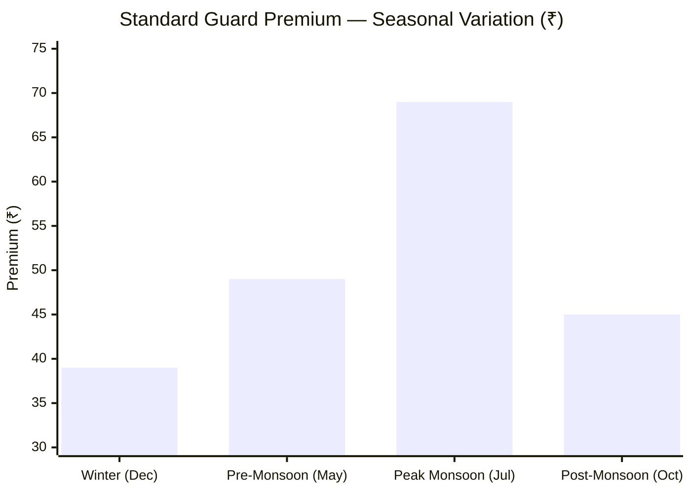

> [!NOTE]
> **Affordability Guardrail:** Premium is hard-capped at **0.8% of estimated weekly net income** — ensuring it never becomes unaffordable for the lowest-earning riders.
>
> **Resilience Streak Discount:** 3 consecutive disruption-free weeks → premium drops by 10%.

---


<a name="-parametric-triggers--what-fires-a-payout"></a>

> Every trigger must be: **(a)** objectively measurable via public APIs, **(b)** directly correlated with income loss, and **(c)** independently verifiable to resist fraud.

<div align="center">

| # | Trigger | Threshold | Data Sources | Income Loss | Frequency |
|:-:|:--------|:----------|:-------------|:----------:|:--------:|
| 1 | 🌧️ **Heavy Rainfall** | ≥ 64.5 mm/24hr (IMD) | OpenWeatherMap + IMD API | 40-90% | Mumbai: 15-25 days/monsoon |
| 2 | 🌊 **Extreme Rain / Flooding** | ≥ 204.5 mm/24hr OR NDMA Red Alert | NDMA SACHET + GDACS | 70-100% | Mumbai: ~4 events/year |
| 3 | 🔥 **Severe Heatwave** | ≥ 45°C for ≥ 2 consecutive days | OpenWeatherMap + IMD Bulletins | 20-40% | Delhi: 10-25 days/year |
| 4 | 🏭 **Hazardous AQI** | AQI ≥ 401 for 24 continuous hours | WAQI API + CPCB stations | 15-30% | Delhi: 30-50 days/winter |
| 5 | ☁️ **Platform Outage** | HTTP 503/504 for > 15 min, 3+ probes | Synthetic monitoring + Downdetector | ~100% | Cloudflare Dec 2025 |
| 6 | 🚨 **Civil Disruption** | Section 144 / Curfew ≥ 4 hours | GDELT + NewsAPI + Gazette feeds | 60-80% | Multiple events 2023-25 |

</div>

<details>
<summary><b>🔎 Deep Dive: Why Platform Outage Insurance is our Blue-Ocean Differentiator</b></summary>

### Digital Infrastructure Disruption Index

Beyond weather, we monitor:
- **Platform outages** — synthetic probes + public reporting
- **Payment rail failures** — UPI/IMPS downtime affecting payout settlement
- **Internet shutdowns** — government-mandated, tracked via GDELT + IP traffic analysis

**This is credible because:**
- Blinkit nationwide outage (Feb 2024) — documented
- Swiggy Instamart outage (Oct 2024) — documented
- Cloudflare Dec 2025 outage → simultaneously killed Blinkit, Zerodha, Groww, and other platforms
- Human Rights Watch documents that internet shutdowns directly remove access to app-mediated gig work

**No other team will insure digital infrastructure downtime.** This is our unique moat.

</details>

---


<a name="-aiml-engine"></a>

### 🏷️ 6.1 — Dynamic Premium Pricing

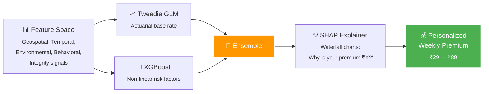

<details>
<summary><b>📋 Complete Feature Space (All measurable in hackathon)</b></summary>

| Category | Features |
|:---------|:---------|
| **Geospatial** | Rider's operational pincode, H3 cell (Res 7-8), elevation proxy, distance to coast/floodplain |
| **Temporal** | Week-of-year, monsoon flag, festival indicator, day-length |
| **Environmental** | 7-day weather forecast, trailing AQI averages, seasonal pollution patterns |
| **Rider Behavior** | Declared shift window, avg active hours, claim history, "online but stationary" ratio |
| **Integrity** | Device attestation status, GPS accuracy radius, spoof-risk score |

</details>

### 🛡️ 6.2 — Intelligent Fraud Detection (4-Layer Pipeline)

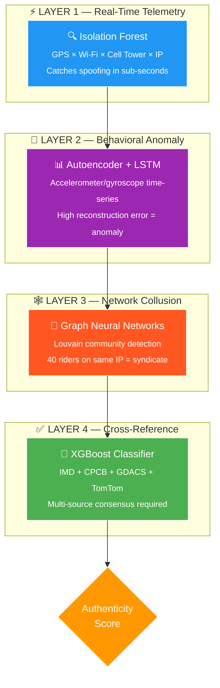

### 🔮 6.3 — Predictive Risk Engine (Competitive Moat)

<table>
<tr>
<td width="50%">

**Architecture:** LSTM (48-hour lookback, 7 features, 2 layers of 64+32 units) + XGBoost ensemble

**Inputs:** Multi-model weather forecasts, seasonal climatology, historical trigger counts, AQI patterns, NDMA alerts

</td>
<td width="50%">

**Two strategic outputs:**

1. 📈 **Underwriting discipline** — premiums adjust BEFORE monsoon spikes, protecting the loss ratio

2. 🔔 **Preventive intelligence alerts** — WhatsApp: *"Heatwave expected in your zone tomorrow. Consider the evening shift."*

</td>
</tr>
</table>

> [!IMPORTANT]
> **🦄 Unicorn Feature — Preventive Payouts**
>
> If severe heat is predicted **48 hours ahead**, auto-disburse **₹50** to the rider's wallet earmarked for ORS (Oral Rehydration Salts) and water.
>
> By investing ₹50 proactively, we **prevent** the much larger ₹600 claim — transforming insurance from **reactive to proactive**.
>
> *This is insurance reimagined. Not just paying after disaster — preventing the loss entirely.*

---


<a name="️-adversarial-defense--anti-spoofing-strategy"></a>

> [!WARNING]
> **Market Crash Scenario:** 500 delivery workers coordinate via Telegram, install GPS-spoofing apps, fake locations into a red-alert weather zone while resting at home — attempting to drain the liquidity pool.
>
> **Our response: GPS is only 10% of our authenticity score.** We have 6 other signals they can't fake.

### 7-Signal Authenticity Scoring Matrix

<div align="center">

| Signal | What It Detects | Why Spoofers Can't Fake It | Weight |
|:------:|:---------------|:--------------------------|:------:|
| 📍 **GPS** | Basic location | Easily spoofed — baseline only | **10%** |
| 📶 **Wi-Fi BSSID** | Nearby Wi-Fi networks | Spoofing GPS doesn't change which routers your phone sees | **20%** |
| 📡 **Cell Tower ID** | Tower connections | Hardware-level; GPS apps don't alter cellular connections | **20%** |
| 🌐 **IP Geolocation** | ISP routing location | GPS says "Andheri" but IP resolves to "Thane" = caught | **10%** |
| 📳 **Accelerometer** | Physical motion | Stranded rider shows micro-movements; home rider = flatline | **20%** |
| 🌡️ **Barometric Pressure** | Altitude + weather | Real rainstorm = pressure drops; dry apartment = normal | **10%** |
| 📊 **Network Latency** | Connection quality | Storm zones show degraded signal; home Wi-Fi = pristine | **10%** |

</div>

```
    Composite Authenticity Score: 0 ──────────────────────────── 100

    ❌ AUTO-REJECT     🔍 MANUAL REVIEW     ⏳ ESCROW      ✅ AUTO-APPROVE
    ├─────────────────┤├──────────────────┤├─────────────┤├───────────────┤
    0                 24                  44             75              100
```

<details>
<summary><b>🕸️ How We Catch the 500-Rider Syndicate</b></summary>

### Graph-Based Collusion Detection

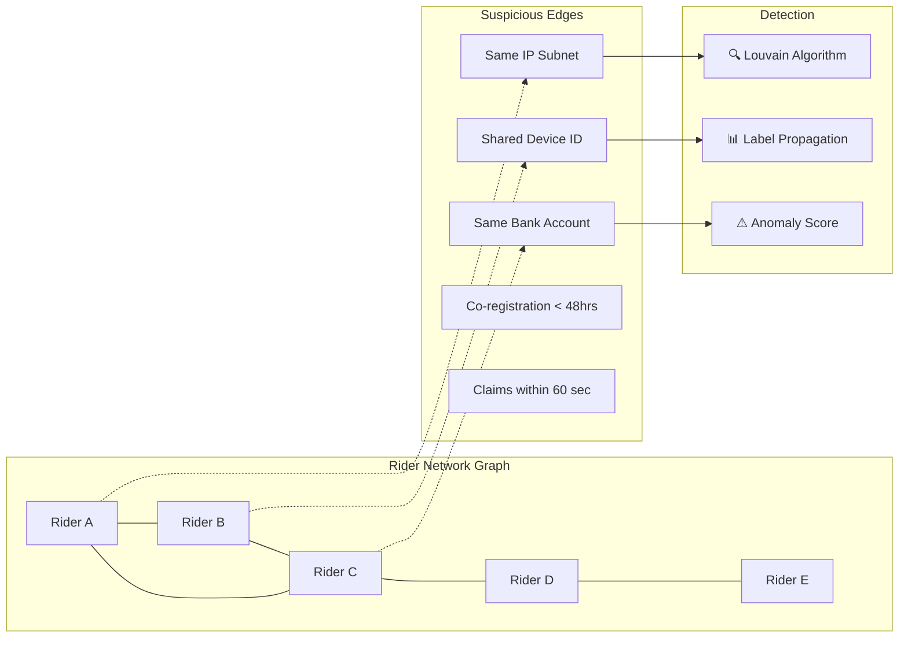

| Signal | Normal Pattern | 🚨 Fraud Ring Pattern | Detection |
|:-------|:--------------|:---------------------|:----------|
| Claim timing | Spread across hours | 500 claims in 60-second window | Burst detection |
| IP addresses | Diverse ISPs | Same subnet cluster | Entropy analysis |
| Device fingerprints | Unique per rider | Shared IMEI/cloned apps | Hash collision |
| Referral chains | Organic, varied | Linear chain from 1 source | Graph depth analysis |
| Claim-to-registration | Claims after weeks | Claims within days of signup | Velocity scoring |

**The Telegram Tell:** 500 riders claiming from the "same zone" within 60 seconds — but cell tower data shows they're in 200+ different locations. A genuine weather event causes claims to trickle over 30-60 minutes. Instantaneous mass claims are a **statistical impossibility** in organic disruption.

</details>

<details>
<summary><b>⚖️ UX Balance — Protecting Honest Workers</b></summary>

### Graduated Response Protocol

| Score | Action | Rider Sees |
|:-----:|:-------|:-----------|
| **75-100** ✅ | Auto-approve, instant payout | *"₹300 credited. Stay safe! 🌂"* |
| **45-74** ⏳ | Escrow hold (2 hrs), enhanced verification | *"Processing. Confirmed within 2 hours."* + optional selfie/screenshot |
| **25-44** 🔍 | Manual review (24 hrs) | *"We need more time to verify. You'll hear within 24 hours."* |
| **0-24** ❌ | Soft block + investigation | *"Couldn't verify disruption. Tap to request review."* |

**Critical Principles:**
1. **Never punish network drops** — use last-known-good location + zone-level disruption confirmation
2. **Benefit-of-the-doubt** — clean-history riders get payouts with soft flag, not hold
3. **Appeal mechanism** — one-tap "Request Review" + 10% bonus for wrongful rejections
4. **Syndicate isolation** — punish the network, not the neighborhood

</details>

---


<a name="-zero-touch-claims--the-user-experience"></a>

### Onboarding: 3 Screens, < 60 Seconds

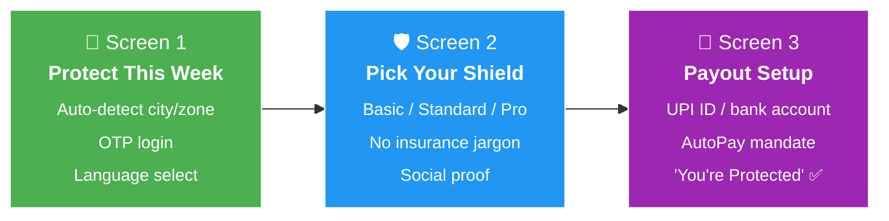

### Claims Flow — Completely Invisible to Rider

> **Target:** Disruption → Money-in-account: **< 30 minutes** for auto-approved claims.

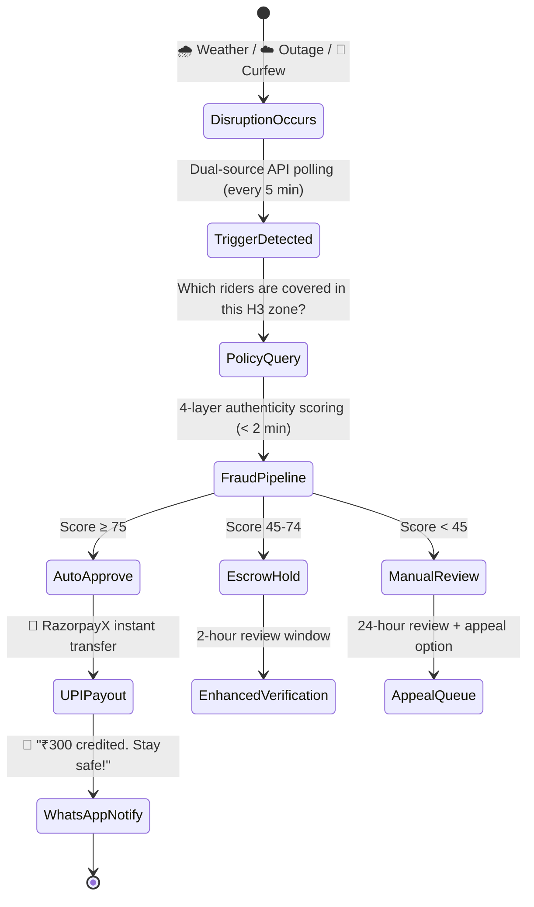

### Platform Architecture

| Audience | Platform | Why |
|:--------:|:--------:|:----|
| 🛵 **Riders** | PWA + WhatsApp Bot | Zero-install, works on low-end Android, 500M+ Indian WhatsApp users |
| 📊 **Insurers** | Web Dashboard | Loss ratios, fraud analytics, trigger feed, premium volume |

---


<a name="-tech-stack--architecture"></a>

### System Architecture

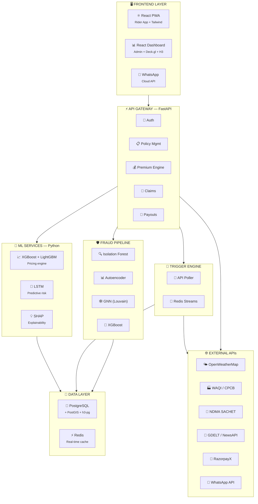

### Tech Stack at a Glance

<div align="center">

| Layer | Technology | Why |
|:-----:|:----------:|:----|
| **Frontend** |   | Fast, mobile-first, offline-capable |
| **Admin** |   | H3 hexagonal risk maps in WebGL |
| **Backend** |  | Async, high-performance, ML-native |
| **ML/AI** |   | Gradient boosting + deep learning |
| **Database** |  | Geospatial + ACID for financial records |
| **Cache** |  | Real-time zone scores + event streaming |
| **Payments** |  | Instant UPI payouts with idempotency |
| **Messaging** |  | 500M+ Indian users |
| **Monitoring** |  | Trigger latency + system health |
| **Deploy** |   | Zero-infrastructure management |

</div>

<details>
<summary><b>📡 External APIs — All Free/Freemium Tier</b></summary>

| API | Free Tier | Use Case |
|:----|:----------|:---------|
| OpenWeatherMap 3.0 | 1,000 calls/day | Precipitation, temperature, severe alerts |
| WeatherAPI.com | 1M calls/month | Backup weather + built-in AQI |
| WAQI (aqicn.org) | 1,000 req/sec | Real-time AQI from CPCB stations |
| OpenAQ v3 | Unlimited | Historical air quality for model training |
| NDMA SACHET | Free (RSS/JSON) | Cyclone, flood, earthquake CAP alerts |
| GDACS | Free (6-min updates) | International disaster alerts, flood severity |
| GDELT Project | Free (BigQuery) | Civil disruption, protest, curfew detection |
| NewsAPI | 100 req/day | Strike/curfew news corroboration |
| RazorpayX | Test mode (free) | UPI payout simulation |
| WhatsApp Cloud API | 1,000 conv/month | Notifications + onboarding |

</details>

---


<a name="-financial-viability--unit-economics"></a>

### Weekly P&L — 10,000 Riders

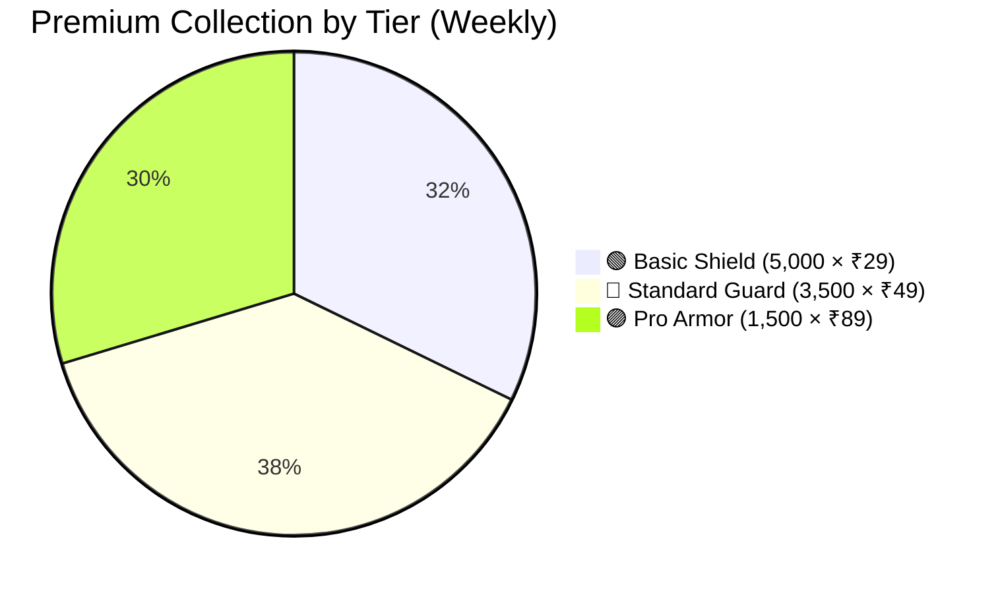

<div align="center">

| | Collection | Claims | Loss Ratio |
|:-|:---------:|:------:|:----------:|
| 🟢 Basic (50%) | ₹1,45,000 | ₹75,000 | 51.7% |
| 🔵 Standard (35%) | ₹1,71,500 | ₹1,57,500 | 91.8% |
| 🟣 Pro (15%) | ₹1,33,500 | ₹1,50,000 | 112.4% |
| **📊 Portfolio** | **₹4,50,000** | **₹2,82,500** | **62.8%** ✅ |

</div>

> **Target Loss Ratio: 60-65%** — our 62.8% sits right in the sweet spot.

### 🦄 Key Metrics

<div align="center">

| Metric | Value | Benchmark |
|:-------|:-----:|:---------:|
| **Customer Acquisition Cost** | ₹45 | WhatsApp referrals + dark-store partnerships |
| **Average Weekly Premium** | ₹45 | Blended across tiers |
| **Average Retention** | 26 weeks | Conservative (65% annual gig attrition) |
| **Lifetime Value (LTV)** | **₹435** | $45 × 26 × (1 - 0.628)$ |
| **LTV / CAC Ratio** | **9.7x** | Benchmark: > 3x is venture-scale |
| **Break-even Subscribers** | **~5,000** | Achievable in first 3 months |

</div>

<details>
<summary><b>🌧️ Monsoon Stress Test</b></summary>

During peak monsoon, trigger probability rises to 25-35%. The dynamic pricing engine responds:

1. **Premium auto-adjusts** — Standard: ₹49 → ₹69 for high-risk zones
2. **Episode caps** — max 4 disruption windows/week
3. **Smart-reserve pool** — winter surplus funds monsoon payouts

</details>

---


<a name="-development-roadmap"></a>

### Phase 2: Automation & Protection <sub>Mar 21 - Apr 6</sub>

- [x] Registration and onboarding flow (3-screen PWA)
- [x] Insurance policy management (CRUD + weekly renewal endpoint)
- [x] Dynamic premium calculation (actuarial pricing engine with zone + seasonal + streak factors)
- [x] 6 automated parametric triggers with real OpenWeatherMap API + mock integrations
- [x] Autonomous trigger polling — APScheduler polls all active cities every 15 min (zero-touch)
- [x] Income-replacement payout model — payouts proportional to city-calibrated daily income
- [x] Civil Disruption trigger live — 8% probability, random type and duration
- [x] Claims management with 4-signal fraud scoring (city, device, frequency, history)
- [x] Admin dashboard with auth-protected analytics endpoints
- [x] MetaMask-style dark PWA UI with Inter typography system
- [x] RazorpayX test-mode payout integration
- [x] 2-minute demo video

### Phase 3: Scale & Optimize <sub>Apr 5 - 17</sub>

- [x] Advanced fraud detection (all 4 layers — Autoencoder, LSTM, GNN, XGBoost)
- [x] Instant payout system (simulated end-to-end)
- [x] Predictive risk engine with next-week forecasting
- [x] Worker dashboard (earnings protected, active coverage, trust score)
- [x] Admin dashboard (loss ratios, trigger feed, fraud flags, analytics)
- [x] Evidence Bundle for every claim (multi-source proof card)
- [x] GPS / Location Engine Hardening (Phase 3.1)
- [x] Waiting Period / Cooling-Off Logic with 65-test edge-case suite
- [x] Claim Explainability Engine (SHAP-style "Why was I paid/denied?" per claim)
- [x] Source Confidence & Settlement Gating (multi-tier data-source trust rankings)
- [x] Recent Activity Gate (blocks payout if worker has no real app session before claim)
- [x] 5-minute demo video + final pitch deck

### Phase 3.2 — Grievance & Appeals Workflow <sub>Apr 17</sub>

> Every disputable decision now has a structured, auditable, SLA-enforced resolution path.

- [x] **GrievanceCase ORM** — 5 new DB tables: `GrievanceCase`, `GrievanceMessage`, `GrievanceDecision`, `GrievanceAuditEvent`, `ClaimSnapshot`
- [x] **Grievance Service** — deterministic triage engine (AUTO / OPS / CLAIM_REVIEW / INSURER queues), 72-hour SLA enforcement, reopen limit, immutable claim snapshot
- [x] **Worker API** (`/cases`, `/cases/{id}`, `/claims/{id}/appeal`, `/claims/{id}/appeal-eligibility`) — structured appeal & grievance submission with 48-hour eligibility window
- [x] **Admin API** (`/admin/cases`) — queue list, triage override, resolve (uphold/reverse/partial), escalate to insurer, reopen, payout-retry
- [x] **Claim Snapshot Hook** — every auto-generated claim persists immutable decision inputs for future appeal audit
- [x] **Frontend — Cases tab** — new bottom nav item, SLA promise banner, case list with status badges
- [x] **Frontend — Appeal Bottom Sheet** — 2-step structured form (9 reason codes → summary textarea) replaces old `confirm+prompt`
- [x] **Frontend — Grievance Bottom Sheet** — 2-step form (9 category codes → textarea)
- [x] **Frontend — Case Detail Panel** — full-screen overlay with message timeline (🤖 Zynvaro / 👤 Worker), decision block, worker reply form
- [x] **Test Suite** — 42 unit tests (`test_grievance_service.py`) + 22 API tests (`test_cases_api.py`) — **1,337 passed, 0 failed**
- [x] **Bug Fix** — case detail panel moved outside `#app-wrapper` (which has `position:fixed; overflow:hidden`) so it renders as a true full-screen viewport overlay

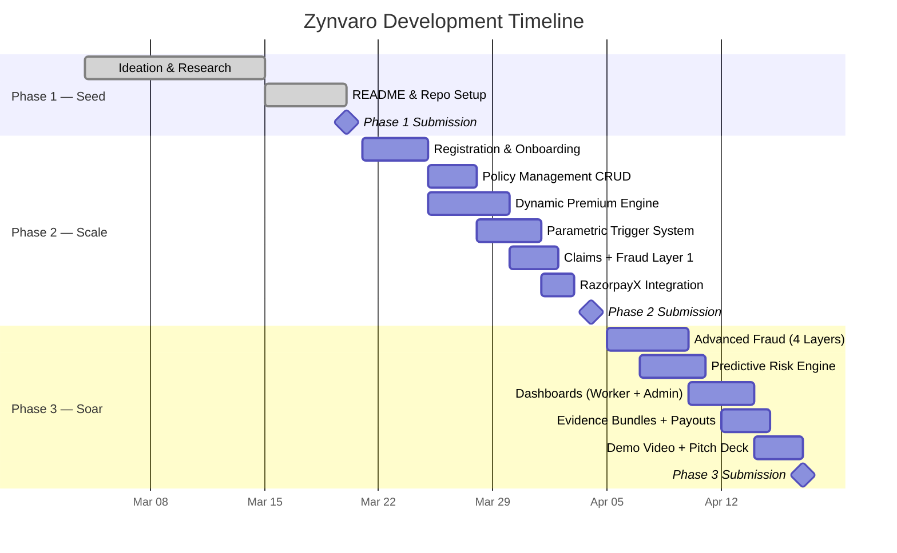

---


<a name="-why-zynvaro-wins"></a>

### What Makes This a ⭐⭐⭐⭐⭐, Not a ⭐⭐⭐

<div align="center">

| Dimension | ⭐⭐⭐ Meets Brief | ⭐⭐⭐⭐⭐ Zynvaro |
|:---------:|:------------------:|:------------------:|
| **Architecture** | Single weather trigger, cron polling, monolithic backend | Multi-source event-driven pipeline, H3 spatial grid, 4-layer fraud ML, streaming |
| **UX** | Download app, fill forms, press "Claim Now" | Zero-install PWA + WhatsApp, 3-screen onboard, zero-touch claims, money in 5 min |
| **Logic** | "It rained, so pay everyone" | IMD/CPCB official thresholds, dynamic pricing with SHAP explainability, 62% loss ratio, LTV/CAC 9.7x |

</div>

### 🦄 Our 5 Unicorn Differentiators

<table>
<tr>
<td align="center" width="20%">

**☁️**<br>**Platform Outage Insurance**

<sub>We insure digital infrastructure downtime. Cloudflare Dec 2025 outage proves it's real.</sub>

</td>
<td align="center" width="20%">

**🔮**<br>**Preventive Payouts**

<sub>AI predicts heatwave 48hrs ahead, sends ₹50 for ORS. Prevents the ₹600 claim.</sub>

</td>
<td align="center" width="20%">

**📋**<br>**Evidence Bundles**

<sub>Every payout shows a "Proof Card" with 2+ weather sources, AQI, zone match, logs.</sub>

</td>
<td align="center" width="20%">

**🗺️**<br>**H3 Hexagonal Grid**

<sub>Uber's H3 + Deck.gl WebGL for hyper-local zone risk visualization.</sub>

</td>
<td align="center" width="20%">

**🛡️**<br>**Anti-Spoofing**

<sub>7-signal authenticity scoring + graph syndicate detection. Market Crash proof.</sub>

</td>
</tr>
</table>

---

---

## 🚀 Phase 2 — Running the Live Demo

> This section covers everything needed to run, judge, and explore the Zynvaro prototype locally.

### Prerequisites

| Tool | Version | Install |
|:-----|:-------:|:--------|
| **Python** | 3.9+ | [python.org](https://www.python.org) |
| A web browser | Any modern | Chrome recommended |

### 1. Install Dependencies

```bash
cd zynvaro-app/backend
pip install -r requirements.txt
```

### 2. Start the Backend (FastAPI)

**Windows:**
```batch
zynvaro-app\start.bat
```

**Mac / Linux:**
```bash
cd zynvaro-app/backend
uvicorn main:app --reload --port 9001
```

Backend runs at: `http://localhost:9001`
Interactive API docs: `http://localhost:9001/docs`

### 3. Serve the Frontend (PWA)

```bash
python -m http.server 5500 --directory zynvaro-app/frontend
```

Open in browser: `http://localhost:5500/app.html`

---

### 🎬 Demo Flow (2-Minute Walkthrough)

Follow this exact sequence to reproduce the demo video:

#### Step 1 — Login with Demo Account
- Phone: **`9876543210`**
- Password: **`demo1234`**

#### Step 2 — Explore Dashboard
- See **ACTIVE** policy status, weekly premium, max payout
- Risk profile: city, zone risk score, claim history
- Live trigger feed (3 seeded events pre-loaded)

#### Step 3 — View Policy & AI Pricing
- Navigate to **Policy** tab
- Click any tier card → **Premium Breakdown** opens
- See: Zone loading, seasonal factor, streak discount, AI explanation
- Click **Activate** to switch tiers

#### Step 4 — Fire a Parametric Trigger ← THE MAGIC MOMENT
1. Navigate to **Triggers** tab
2. Select: `Extreme Rain / Flooding` + City: `Bangalore`
3. Click **🚨 Fire Trigger & Auto-Generate Claims**
4. Wait 3 seconds…
5. **WhatsApp-style notification appears** showing auto-credited payout 🎉
6. Click "View My Claims" — lands on Claims page with new claim auto-generated

> **Note:** The backend also autonomously polls all active cities every 15 minutes via APScheduler. Claims can appear without any button press — the "Simulate" button just speeds it up for demo purposes.

#### Step 5 — Review Claims (Zero-Touch)
- Claim shows: trigger type, payout amount, authenticity score bar
- Status: `AUTO APPROVED` — no forms, no calls, no waiting
- Payment ref: `MOCK-UPI-CLM-XXXXXXXX`

#### Step 6 — Admin Dashboard
- Navigate to **Admin** tab
- See: platform-wide stats, workers table with zone risk %, loss ratio gauge
- Claims by trigger type breakdown

---

### 🗂️ Project Structure

```
zynvaro-app/
├── backend/
│   ├── main.py              # FastAPI app + router registration (priority: cases > claims)
│   ├── models.py            # ORM: Worker, Policy, TriggerEvent, Claim + 5 Grievance tables
│   ├── database.py          # SQLite + SQLAlchemy
│   ├── routers/
│   │   ├── auth.py          # Register, Login (JWT), /me
│   │   ├── policies.py      # Quote, Activate, Cancel, Renewal
│   │   ├── triggers.py      # Simulate trigger + auto-claim + snapshot hook
│   │   ├── claims.py        # Claims CRUD + admin stats + workers + explainability
│   │   ├── cases.py         # [NEW] Worker-facing grievance & appeal API
│   │   └── admin_cases.py   # [NEW] Admin case queue + resolve/escalate/reopen
│   ├── services/
│   │   ├── trigger_engine.py    # 6 parametric trigger checks + fraud scoring
│   │   ├── grievance_service.py # [NEW] Triage, SLA, state transitions, snapshot
│   │   ├── cooling_off.py       # Waiting period / cooling-off rules
│   │   ├── explainability.py    # Claim explainability payloads
│   │   ├── source_hierarchy.py  # Data-source confidence & settlement gating
│   │   └── waiting_period.py    # Policy waiting period enforcement
│   ├── tests/
│   │   ├── api/
│   │   │   ├── test_cases_api.py          # [NEW] 22 grievance/appeal API tests
│   │   │   ├── test_claim_explainability_api.py
│   │   │   └── test_waiting_period_api.py
│   │   └── unit/
│   │       ├── test_grievance_service.py  # [NEW] 42 unit tests
│   │       ├── test_cooling_off_service.py
│   │       ├── test_explainability_payload.py
│   │       ├── test_recent_activity_gate.py
│   │       ├── test_source_confidence.py
│   │       └── test_waiting_period_rules.py
│   └── requirements.txt
└── frontend/
    ├── app.html             # Single-file PWA — 6 pages incl. Cases & Appeals
    ├── manifest.json        # PWA installability
    └── sw.js                # Service worker (offline support)
```

### 🔑 Key API Endpoints

| Method | Endpoint | Auth | Description |
|:------:|:---------|:----:|:------------|
| `POST` | `/auth/register` | No | Worker registration |
| `POST` | `/auth/login` | No | JWT login |
| `GET`  | `/auth/me` | ✅ | Current worker profile |
| `GET`  | `/policies/quote/all` | ✅ | AI-calculated quotes for all 3 tiers |
| `POST` | `/policies/` | ✅ | Activate a new weekly policy |
| `POST` | `/policies/renew` | ✅ | Renew active policy for another 7 days |
| `DELETE` | `/policies/{id}` | ✅ | Cancel active policy |
| `GET`  | `/triggers/live` | ✅ | Live trigger check → auto-claims if fired |
| `POST` | `/triggers/simulate` | ✅ | **[DEMO]** Force-fire a trigger → auto-claims |
| `GET`  | `/triggers/types` | No | All 6 trigger types + thresholds |
| `GET`  | `/claims/` | ✅ | Worker's claims list |
| `GET`  | `/claims/stats` | ✅ | Worker's claim statistics |
| `GET`  | `/claims/admin/stats` | ✅ | Platform analytics |
| `GET`  | `/claims/admin/workers` | ✅ | All workers + policy status |
| `GET`  | `/claims/admin/all` | ✅ | All claims with fraud scores |
| `GET`  | `/claims/{id}/appeal-eligibility` | ✅ | **[NEW]** Pre-flight appeal check — 48h window, open case check, prefilled codes |
| `POST` | `/claims/{id}/appeal` | ✅ | **[NEW]** Submit structured appeal → creates `GrievanceCase` |
| `POST` | `/cases` | ✅ | **[NEW]** Submit generic grievance (non-claim) |
| `GET`  | `/cases` | ✅ | **[NEW]** Worker's own case list |
| `GET`  | `/cases/{id}` | ✅ | **[NEW]** Case detail + messages + decision |
| `POST` | `/cases/{id}/messages` | ✅ | **[NEW]** Worker reply (when status is `WAITING_FOR_WORKER`) |
| `GET`  | `/admin/cases` | ✅ Admin | **[NEW]** All cases — filterable by status/queue/SLA |
| `GET`  | `/admin/cases/{id}` | ✅ Admin | **[NEW]** Full admin case view including claim snapshot |
| `POST` | `/admin/cases/{id}/resolve` | ✅ Admin | **[NEW]** Uphold / Reverse / Partial — mandatory internal note |
| `POST` | `/admin/cases/{id}/triage` | ✅ Admin | **[NEW]** Override triage queue |
| `POST` | `/admin/cases/{id}/escalate` | ✅ Admin | **[NEW]** Escalate to insurer queue |
| `POST` | `/admin/cases/{id}/reopen` | ✅ Admin | **[NEW]** Reopen resolved case (up to 2× limit) |

### 🌱 Seeded Demo Data

The backend auto-seeds on first start:

| Worker | City | Policy | Platform | Demo Claim |
|:-------|:----:|:------:|:--------:|:----------:|
| Ravi Kumar | Bangalore | Basic Shield | Blinkit | MANUAL REVIEW (city mismatch) |
| Priya Sharma | Mumbai | Standard Guard | Zepto | **AUTO APPROVED** ✅ |
| Arjun Mehta | Delhi | Pro Armor | Instamart | PENDING REVIEW (high frequency) |
| Sneha Rao | Hyderabad | Standard Guard | Blinkit | — |
| Kiran Patel | Chennai | Pro Armor | Zepto | — |

> Demo login: **Priya Sharma** — `9876543211` / `demo1234` (her claim is AUTO_APPROVED, best showcase)
> Or use Ravi Kumar: `9876543210` / `demo1234`

---

## 👥 Team AeroFyta

<div align="center">

| | Name | Role |
|:-:|:----:|:----:|
| 👨‍💻 | **Danish A G** | Team Lead |
| 👨‍💻 | **Sanjay N** | Developer |
| 👨‍💻 | **Athishaya K** | Developer |
| 👨‍💻 | **Vishal C B** | Developer |
| 👨‍💻 | **Hariharan C V** | Developer |

</div>

---

<div align="center">

### *Zynvaro — Because every delivery matters. Every rider deserves a safety net.*

<sub>Built with conviction by **Team AeroFyta** for **Guidewire DEVTrails 2026 — Unicorn Chase**</sub>

<br>


</div>
